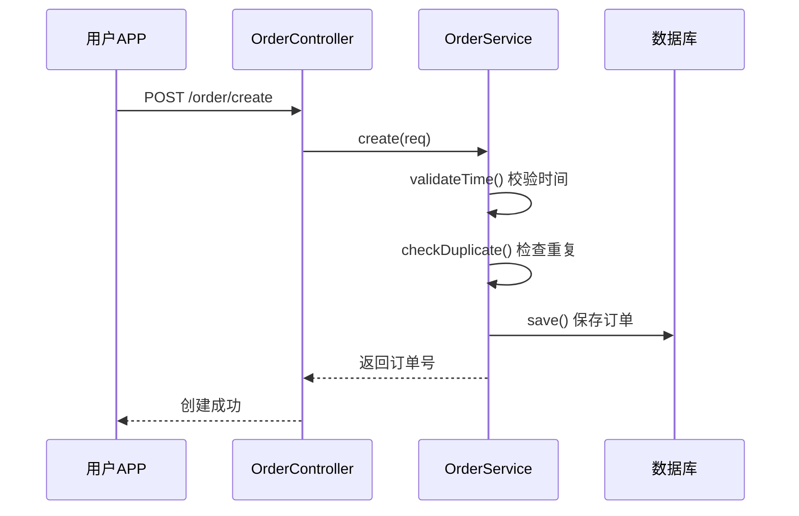
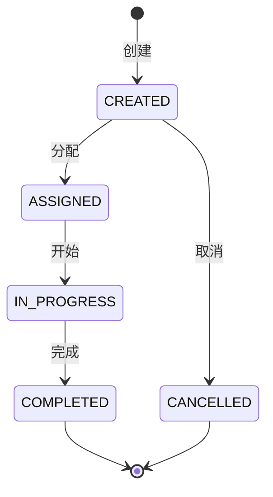

# 分步补充文档提示词

> 当模块文档过大时，使用分步提示词让 AI 逐步完成，避免遗漏

---

## 🎯 使用方法

**不要一次性让 AI 补充整个文档！**

按以下顺序，每次只发一个提示词给 AI，等 AI 完成后再发下一个。

---

## 第 1 步：补充业务场景（复制使用）

```
请打开 openspec/modules/[模块名].md 文件。

只做这一件事：补充【🎯 业务场景】章节。

要求：
1. 阅读该模块的 Controller 和 Service 代码
2. 理解这个模块解决什么业务问题
3. 按以下格式填写：

## 🎯 业务场景

- **核心价值**: [该模块解决的核心业务问题]
- **服务对象**: [哪些用户群体/系统使用这个模块]
- **场景1**: [具体业务场景，如"用户预约专车出行"]
- **场景2**: [具体业务场景]
- **场景3**: [具体业务场景]

完成后告诉我："✅ 业务场景已补充"
```

---

## 第 2 步：补充核心业务流程（复制使用）

```
继续编辑 openspec/modules/[模块名].md 文件。

只做这一件事：补充【🔄 核心业务流程】章节。

要求：
1. 找出该模块最重要的 1-2 个业务流程（如订单创建、订单取消）
2. 阅读相关 Controller 和 Service 代码，理解调用链
3. 用 Mermaid sequenceDiagram 绘制流程图

格式要求：
- 每个流程一个序列图
- 标注关键的业务检查和处理步骤
- 中文注释

示例：
### 流程1: 订单创建流程



完成后告诉我："✅ 核心业务流程已补充"
```

---

## 第 3 步：补充业务规则（复制使用）

```
继续编辑 openspec/modules/[模块名].md 文件。

只做这一件事：补充【📜 核心业务规则】章节。

要求：
1. 阅读 Service 代码中的校验逻辑和业务判断
2. 提取 3-5 个核心业务规则
3. 每个规则说明：判断条件、处理逻辑、异常情况

格式：
### 规则1: [规则名称]
- **判断条件**: [什么情况下触发]
- **处理逻辑**: [如何处理]
- **异常情况**: [边界场景如何处理]

完成后告诉我："✅ 核心业务规则已补充"
```

---

## 第 4 步：补充状态流转（复制使用）

```
继续编辑 openspec/modules/[模块名].md 文件。

只做这一件事：补充【🔀 状态流转】章节。

要求：
1. 找出该模块的核心实体（如 Order、Task）
2. 找出状态枚举类
3. 用 Mermaid stateDiagram 绘制状态流转图
4. 列出每个状态可执行的操作

格式：


| 状态 | 说明 | 可执行操作 |
|------|------|-----------|
| CREATED | 已创建 | 取消、改约 |
| ASSIGNED | 已分配 | 取消 |

完成后告诉我："✅ 状态流转已补充"
```

---

## 第 5 步：补充 Controller 描述（复制使用）

```
继续编辑 openspec/modules/[模块名].md 文件。

只做这一件事：为所有 Controller 补充描述。

对于每个 Controller：
1. 阅读代码，理解它负责什么业务
2. 补充【描述】：一句话说明业务功能
3. 补充【业务功能】：列出 2-3 个主要功能
4. 补充【服务场景】：说明谁使用这些 API

对于每个 Controller 方法：
1. 补充【用途】：这个接口做什么
2. 补充【重要业务逻辑】：调用了哪些 Service，有什么关键检查

一个一个 Controller 处理，每处理完一个报告一次。

完成后告诉我："✅ Controller 描述已补充"
```

---

## 第 6 步：补充 Service 方法描述（复制使用）

```
继续编辑 openspec/modules/[模块名].md 文件。

只做这一件事：为所有 Service 的核心方法补充描述。

只处理 public 方法，对于每个方法：
1. 阅读代码逻辑
2. 补充业务描述，格式如下：

| 方法 | 参数 | 返回类型 | 业务描述 |
|------|------|----------|----------|
| create() | req | String | **订单创建**<br>1. 校验时间<br>2. 检查重复<br>3. 保存订单 |

重点：
- 说明这个方法做什么（业务目的）
- 列出关键步骤（1. 2. 3.）
- 标注重要的业务规则

一个一个 Service 处理，每处理完一个报告一次。

完成后告诉我："✅ Service 方法描述已补充"
```

---

## 第 7 步：补充 DTO 字段描述（复制使用）

```
继续编辑 openspec/modules/[模块名].md 文件。

只做这一件事：为重要 DTO 的关键字段补充描述。

优先处理：
- 请求参数 DTO（XxxReq）
- 响应结果 DTO（XxxVO、XxxResp）
- 核心实体（Entity）

对于每个重要字段，根据 <!-- AI_INSTRUCTION --> 指令补充：
1. 必填性（从@NotNull等注解判断）
2. 业务含义（从字段名和注释推断）
3. 格式约束（从@Pattern/@Length等注解提取）
4. 枚举值（如果是枚举类型）
5. 示例值（生成符合格式的真实示例）

格式：
| 字段 | 类型 | 说明 | 示例 |
|------|------|------|------|
| code | String | 订单编号，20位前缀ORD | "ORD20250312001234" |
| duration | Long | 行程时长（单位：秒），1800=30分钟 | 1800 |

完成后告诉我："✅ DTO 字段描述已补充"
```

---

## 第 8 步：补充 FAQ（复制使用）

```
继续编辑 openspec/modules/[模块名].md 文件。

只做这一件事：补充【❓ 常见问题 FAQ】章节。

根据你对代码的理解，添加 3-5 个开发者可能遇到的问题：

格式：
### Q1: [问题]
A: [答案]

### Q2: [问题]
A: [答案]

问题类型建议：
- 状态判断类：如"如何判断订单能否取消？"
- 规则解释类：如"什么情况下会触发重复订单检查？"
- 异常处理类：如"创建订单失败的常见原因？"
- 配置说明类：如"超时时间如何配置？"

完成后告诉我："✅ FAQ 已补充"
```

---

## 第 9 步：清理和检查（复制使用）

```
请检查 openspec/modules/[模块名].md 文件。

1. 删除所有【<!-- AI_INSTRUCTION -->】的指令注释
2. 删除所有示例模板文字
3. 确保所有章节都有实际内容
4. 如果有遗漏的描述（显示为 \`-\`），补充完整

检查清单：
- [ ] 业务场景有实际内容
- [ ] 核心业务流程有 Mermaid 图
- [ ] 业务规则有具体内容
- [ ] 所有 Controller 有描述
- [ ] 所有 Controller 方法有用途说明
- [ ] 核心 Service 方法有业务描述
- [ ] 重要 DTO 字段有说明
- [ ] FAQ 有 3-5 个问题

完成后告诉我："✅ 文档检查完成"
```

---

## 💡 使用技巧

1. **一次一步**：每次只发一个提示词，等 AI 完成后再发下一个
2. **替换模块名**：把 `[模块名]` 替换成实际的模块文件名
3. **大模块分批**：如果模块有很多 Controller，可以分批处理（如"先处理前 5 个 Controller"）
4. **及时保存**：每完成一步，确认 AI 已保存文件

## 📋 快速清单

按顺序发送：
1. ✅ 业务场景
2. ✅ 核心业务流程
3. ✅ 业务规则
4. ✅ 状态流转
5. ✅ Controller 描述
6. ✅ Service 方法描述
7. ✅ DTO 字段描述
8. ✅ FAQ
9. ✅ 清理和检查
